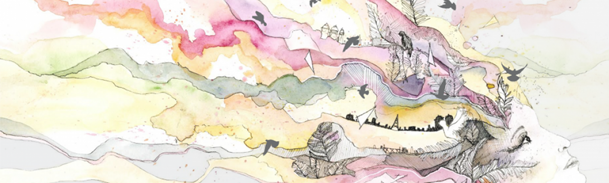
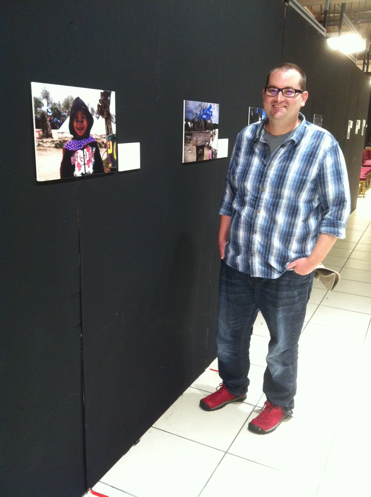

Sheffield Migration Matters Festival
====================================

date: 2016-07-07

   Migration Matters

I am delighted and very proud that I was asked to exhibit some of my
photographs from Lesvos for this year’s `Migration Matters
Festival <http://www.migrationmattersfestival.co.uk/>`__ in Sheffield,
which is held as part of `Refugee Week <http://refugeeweek.org.uk/>`__.
The festival ran from 17th to 25th June 2016 in `Theatre
Delicatessen <http://theatredelicatessen.co.uk/about/the-moor-sheffield/>`__,
with exhibitions from other photographers, workshops held by artists,
and plays performed by local theatre companies. Sadly because I was
recovering from surgery I was unable to attend the talk that my
supervisor gave on the evening of the 23rd – ‘\ `Letters and Pictures
from
Lesvos <http://www.migrationmattersfestival.co.uk/line-up-2016/>`__\ ‘,
but I was able to at least see the static pieces by other photographers
and artists when I visited later in the week.

The festival line up looked superb and the pieces I got to enjoy
(i.e. not the performed pieces) were beautiful, some made by refugees
who now call Sheffield home. I look forward to next year’s festival,
even if I’m not invited to exhibit!

   My exhibition at Migration Matters Festival, 2016
