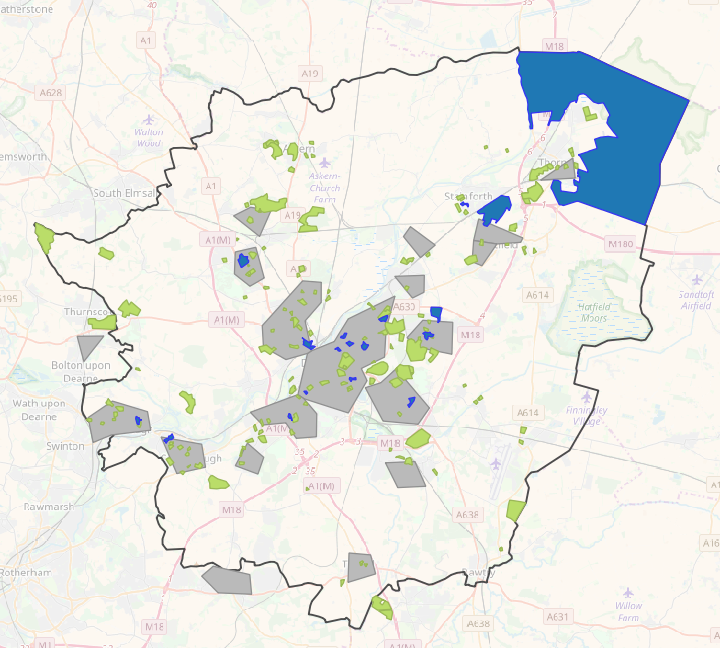

Doncaster Festival of Research
==============================

date: 2017-10-21

   Doncaster Festival of Research 2017

On Friday 20 October I was delighted to present a poster at the
`Doncaster Festival of Research 2017 Fringe
Event <https://www.eventbrite.co.uk/e/doncasters-festival-of-research-fringe-events-tickets-38004578718#>`__
in Denaby and Cadeby Miner’s Welfare in Denaby Main.

With my poster I tried to summarise my doctoral research, which is
challenging because it’s probably most relevant for a policy and
practitioner audience. I hope it was useful for the people who came to
talk to me about it.

The poster summarised the resilient areas in Doncaster I had calculated
with my simulation. Resilient areas were those that had high
unemployment or high area deprivation, but low prevalence of clinical
depression.

-  Resilient areas are blue
-  built-up areas are in grey
-  green spaces are green
-  GP surgeries are red crosses
-  and leisure centres are the icon of a person exercising.

   Resilient areas of Doncaster

At the event there were a couple of videos playing with members of the
local tenants and residents’ association (TARA) and the bumping space
talking about what these groups mean to them.

.. raw:: html

   <iframe width="720" height="405" src="https://www.youtube.com/embed/E4F0zxRreG0" frameborder="0" gesture="media" allowfullscreen>

.. raw:: html

   </iframe>

.. raw:: html

   <iframe src="https://player.vimeo.com/video/163719160?color=588d93&amp;title=0&amp;byline=0&amp;portrait=0" width="720" height="405" frameborder="0" webkitallowfullscreen mozallowfullscreen allowfullscreen>

.. raw:: html

   </iframe>

.. raw:: html

   

Well North. Glyn's Story. from Unity House on Vimeo.

.. raw:: html

   

More details about the event are available on the `event booking
page <https://www.eventbrite.co.uk/e/doncasters-festival-of-research-fringe-events-tickets-38004578718#>`__,
from the `event flyer <../_static/documents/dfor2017-flyer.pdf>`__
(``.pdf``, <1MB), or have a look at the twitter Moment for the Denaby
fringe event below:

#DFoR17 Denaby Fringe event

.. raw:: html

   
