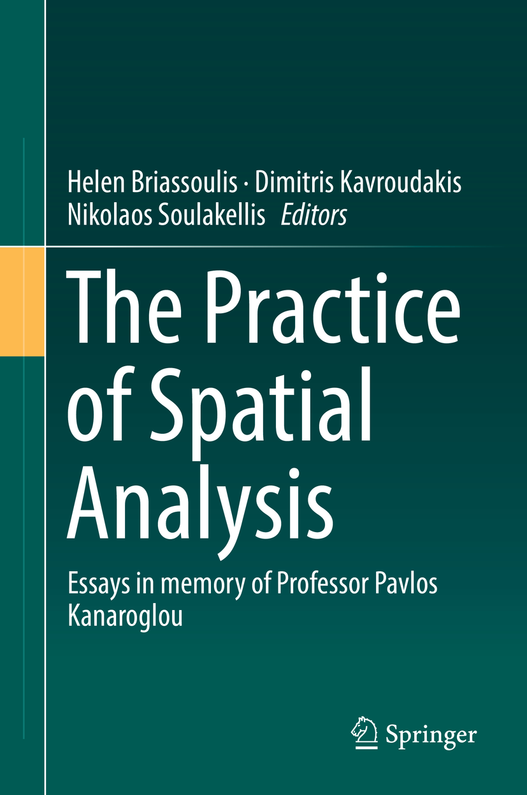

‘Spatial microsimulation and agent-based modelling’ book chapter published
==========================================================================

date: 2018-09-10

Our book chapter (co–authored with `Dimitris
Ballas <https://twitter.com/dimitris_ballas>`__ and `Tom
Broomhead <https://twitter.com/tw_broomhead>`__) was published last
month in the edited collection, “The practice of spatial analysis:
Essays in memory of Professor Pavlos Kanaroglou”.

   The Practice of Spatial Analysis

Full BibTeX reference below:

.. code:: bibtex

   @incollection{spatial-microsimulation-agent-based-modelling,
       author    = {Ballas, Dimitris and Broomhead, Tom and Jones, Phil Mike},
       year      = {2019}
       chapter   = {Spatial microsimulation and agent-based modelling},
       editor    = {Briassoulis, Helen and Kavroudakis, Dimitris and Soulakellis, Nikolaos},
       title     = {The practice of spatial analysis: {E}ssays in memory of {P}rofessor {P}avlos {K}anaroglou},
       Edition   = {1st},
       publisher = {Springer},
       doi       = {10.1007/978-3-319-89806-3},
   }
