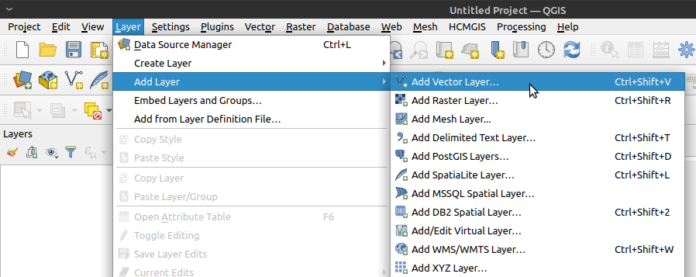
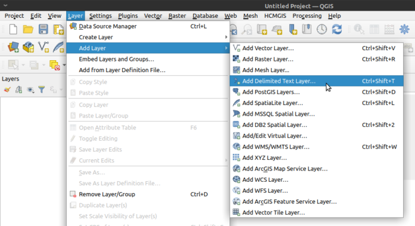
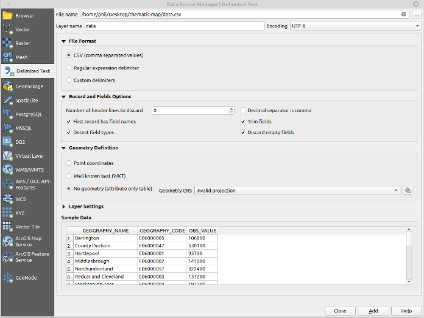
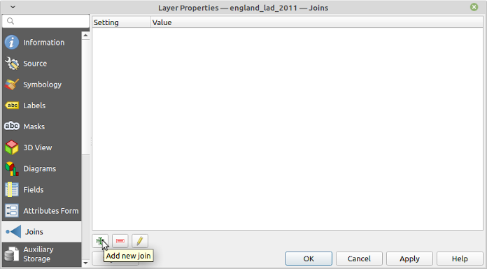
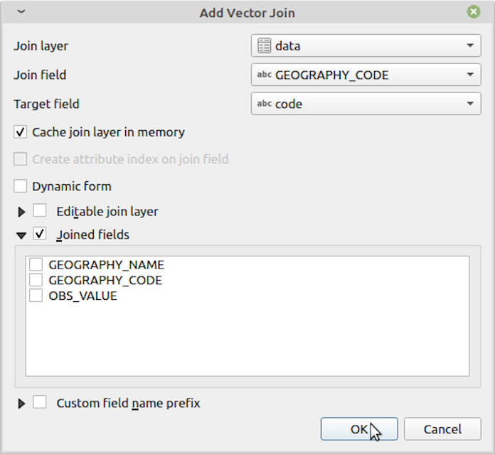

# QGIS: Thematic Mapping with Open Source GIS

date: 2014-05-16

QGIS is a mature open source GIS package that I have been using to produce high quality thematic maps for my PhD.
It is similar to proprietary packages like ArcMap but is, in my opinion, superior for the following reasons:

- I've found QGIS less prone to crashes, particularly when handling large files (> ~100MB)
- I think the QGIS interface makes it easier to understand what layers you're currently working with and have available
- Most importantly, QGIS is freely available and has no cost to download, making it possible for any individual to easily open, replicate and check your analysis

## Obtaining QGIS

- QGIS is available from http://www.qgis.org/en/site/forusers/download.html
- Installation instructions for Ubuntu: https://philmikejones.me/tutorials/2019-01-03-install-qgis-ubuntu.html

## Thematic Mapping with QGIS

Perhaps the most common function of GIS software, particularly in the social sciences, is to produce thematic maps. This involves the following steps:

- Load the outline of the geographical area of interest.
- Load data about the areas about a topic of interest.
- 'Join' the data to the boundary information using a unique key in both files.
- Set the shading of the map based on the joined dataset.

This is easily achieved in QGIS.
I'm using 2018 mid-year population estimates for English local authority districts and London boroughs (LADs) as an example.
You can download the data and map and follow along from these sources (you'll need to extract the shapefile before you can use it):

- https://borders.ukdataservice.ac.uk/ukborders/easy_download/prebuilt/shape/England_lad_2011.zip
- http://www.nomisweb.co.uk/api/v01/dataset/NM_31_1.data.csv?geography=1811939329...1811939332,1811939334...1811939336,1811939338...1811939497,1811939499...1811939501,1811939503,1811939505...1811939507,1811939509...1811939517,1811939519,1811939520,1811939524...1811939570,1811939575...1811939599,1811939601...1811939628,1811939630...1811939634,1811939636...1811939647,1811939649,1811939655...1811939664,1811939667&date=latest&sex=7&age=0&measures=20100&select=geography_name,geography_code,obs_value

## Load a Vector (Map) Layer

I use shapefiles as these appear to be the _de facto_ standard among GIS applications.
Load a shapefile with SHIFT+CTRL+V or by clicking the 'Add Vector Layer' icon (bottom left of this screenshot, looks like a 'V'):

Add the `england_lad_2011.shp` layer, leave the defaults, and press Add.
If QGIS asks about using a fallback transformation use this; the difference in accuracy is 2m rather than 1m (so negligible for our purposes).

## Add Data

To add data about the geography you've loaded and join it to the shapefile click 'Add Delimited Text Layer' (icon looks like a comma).

Here we're using a text delimited file (comma delimited, or `.csv`) and this is a common format data is shared in (particularly for small amounts of data).
You should get the following dialogue box:

The main thing to remember when loading a .csv file is to tell QGIS if your file contains geometry data or not.
Here we've downloaded data that contains a geography code (a unique code for the LAD for joining purposes) but not actually geographical coordinates.
Therefore make sure you select 'No geometry (attribute only table)' from the dialogue box.

## 'Joining' the Two

Once the data is loaded it's time to 'join' it to the shapefile or other layer we loaded earlier.
Right-click on the shapefile (geometry) layer and press 'Properties':

From there, select Joins, then the green plus:

Select your csv file ('Join layer').
If you have only loaded one data layer (as we have) QGIS should automatically detect it.
Then complete the following:

- Join field: `GEOGRAPHY_CODE`
- Target field: `code`
- Tick `Joined fields` and select `GEOGRAPHY_NAME` and `OBS_VALUE`
- Leave all other settings as their defaults

The values you need will differ depending on the files you use and the source you obtain them from, but generally you're trying to match a code to a code
If you end up needing to match place names you must ensure these match exactly or QGIS won't join them (e.g. 'City of Aberdeen' will not join to 'Aberdeen, City of').

## Thematic Mapping

Once the join is completed you can create a thematic map by modifying the 'Symbology' tab of the layer properties.
I typically change 'Single Symbol' to 'Graduated' and selecting an appropriate colour gradient:

The finished result should look something like this. 
