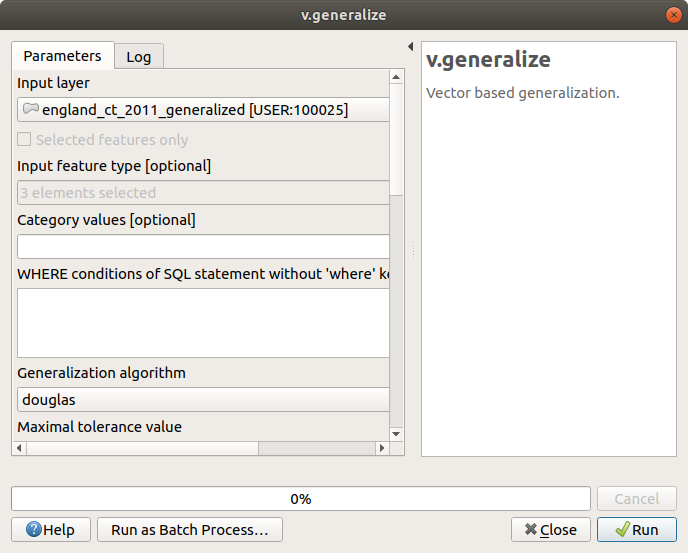
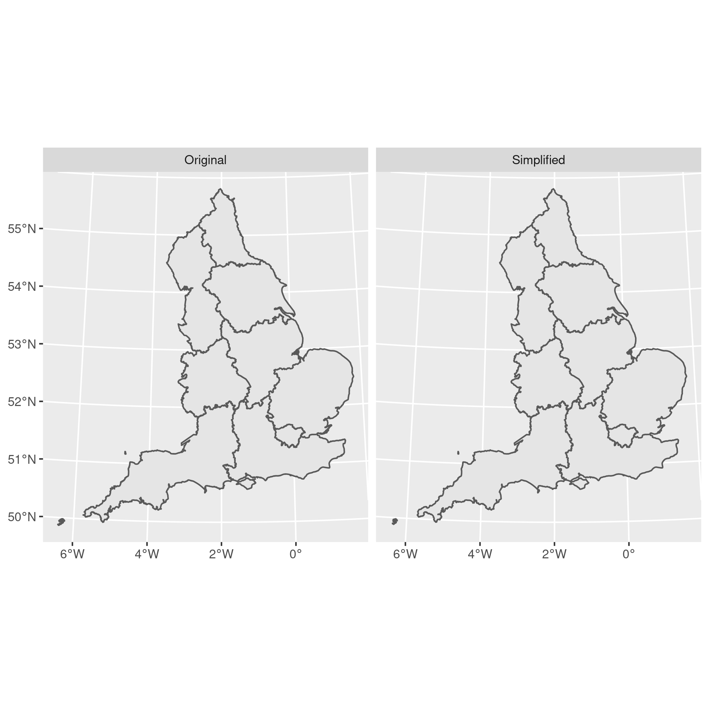

# Simplify polygons without creating slivers

date: 2016-09-29


When you download geographical data the polygons are often highly detailed, leading to large file sizes and slow processing times.
This tutorials shows you how to simplify detailed polygons in R and QGIS without creating slivers (gaps) between the resultant shapes.

When you download boundary data, for example from the [census boundary data](https://census.ukdataservice.ac.uk/get-data/boundary-data) page, the polygons are usually highly detailed.
Often this detail is unnecessary if you're not intending to produce small--scale maps.

Most thematic maps, for example, tend to compare large geographies such as nations or regions, so the detail is unnecessary.
Likewise, if you're producing your map for use on the web, for example as an interactive visualisation, too much detail can slow the rendering and responsiveness of your app.

Downloading pre--simplified versions or trying to simplify the polygons yourself in QGIS or ArcGIS can be unsatisfactory because some simplification functions introduce 'slivers' or gaps between the simplified geometries.

There are at least two approaches to obtaining simplified geometries that are topologically--aware (i.e., you don't end up with any gaps).

> Update 30 August 2018 - it looks like as of QGIS v3 the default simplify function is now topologically aware.


## QGIS -`v.generalize`

One approach is to use the `v.generalize` function in GRASS, and the easiest way to do this is through QGIS.

1. Open QGIS and load your shapefile that you'd like to generalise/simplify.
1. Open the '<i class="fa fa-cog"></i> Toolbox' from the Processing menu
1. Open the GRASS > Vector (v.*) menu
1. Select `v.generalize`



By default this will save a temporary layer which you can then export, or you can specify a filename.
With the default values I was able to simplify a shapefile from 35MB to 11MB, or about $\frac{1}{3}$ of the original size without introducing any gaps.


## R - `rmapshaper`

Traditionally simplifcation was performed with the `rgeos` package in R, but this was not topologically--aware.
The package [rmapshaper](https://cran.r-project.org/package=rmapshaper) simplifies polygons without introducing slivers and gaps, and is compatible with [sf](https://cran.r-project.org/package=sf) and `sp` objects.

Install and load some required packages (I'm assuming you already have `dplyr`, `ggplot2`, `purrr`, and `sf` installed):


```r
# install.packages("rmapshaper")  # install if necessary
library("dplyr")
```

```
## 
## Attaching package: 'dplyr'
```

```
## The following objects are masked from 'package:stats':
## 
##     filter, lag
```

```
## The following objects are masked from 'package:base':
## 
##     intersect, setdiff, setequal, union
```

```r
library("sf")
```

```
## Linking to GEOS 3.9.0, GDAL 3.2.1, PROJ 7.2.1
```

```r
library("rmapshaper")
```

```
## Registered S3 method overwritten by 'geojsonlint':
##   method         from 
##   print.location dplyr
```

```r
library("purrr")
library("ggplot2")
```

Download and unzip the detailed shapefile for simplification:


```r
tmp_dir = tempdir()
tmp     = tempfile(pattern = "", tmpdir = tmp_dir, fileext = ".zip")

download.file(
    paste0(
      "https://borders.ukdataservice.ac.uk/ukborders/easy_download/",
      "prebuilt/shape/infuse_rgn_2011.zip"
    ),
    destfile = tmp
)

unzip(tmp, exdir = tmp_dir)
```

Read the shapefile:


```r
rgn = sf::read_sf(tmp_dir, "infuse_rgn_2011")
```

And simplify:


```r
rgn_simp = rmapshaper::ms_simplify(rgn, keep = 0.01)
```
  
And compare the sizes (for this I've used the `pryr` package but you don't need to do this step):


```r
pryr::object_size(rgn)
```

```
## Registered S3 method overwritten by 'pryr':
##   method      from
##   print.bytes Rcpp
```

```
## 13.4 MB
```

```r
pryr::object_size(rgn_simp)
```

```
## 164 kB
```

So the simplification has definitely worked in terms of file size!
Next lets compare the plots:


```r
rgn_simp$simplified = "Simplified"
rgn$simplified      = "Original"

rgn = purrr::reduce(
  list(rgn, rgn_simp),
  rbind
)

plot = ggplot(rgn) + geom_sf() + facet_wrap( ~ simplified)
```




At this scale I can't tell the difference, which would be perfect for web visualisation and even for printing.
Even if your plots are being printed, you'll save yourself a lot of rendering time over the unsimplified files.
